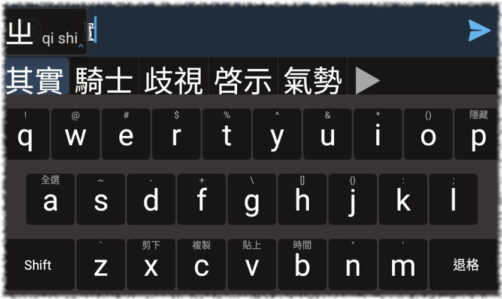

# TRIME Config
maintained by @hkdb



## SUMMARY

Custom config files for TRIME on Android to make the keyboard bigger and more aligned with the AOSP defaults.

## PREREQUISITES

- Having already configured TRIME per https://github.com/Bambooin/rimerc

## USAGE

Launch Termux:

```
cd /sdcard/rime
# wget the latest trime.yaml 
```

## CHANGE

- 09232021 - Added screenshot
- 09232021 - Initial commit
